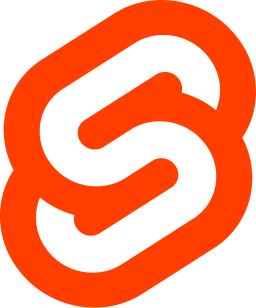

# Hello there, I'm Thomas

#### Connect With Me
[][LinkedIn]&nbsp;&nbsp;&nbsp;&nbsp;

#### Check Out My Playlist!
<a href="https://open.spotify.com/playlist/1rc4BEo9sw0wfW57AnoY9l?si=acfbde41fa174468">
   
</a>

<br>

[](https://open.spotify.com/user/qqcq2h6pr1xe9p1s792354sk4?si=325faf9422d44a18&nd=1)

#### Languages, Frameworks/Libraries, & Database Systems

<div float="left">
    &nbsp;&nbsp;&nbsp;&nbsp;
    &nbsp;&nbsp;&nbsp;&nbsp;
    &nbsp;&nbsp;&nbsp;&nbsp;
    &nbsp;&nbsp;&nbsp;&nbsp;
    &nbsp;&nbsp;&nbsp;&nbsp;
    &nbsp;&nbsp;&nbsp;&nbsp;
    &nbsp;&nbsp;&nbsp;&nbsp;
    &nbsp;&nbsp;&nbsp;&nbsp;
    &nbsp;&nbsp;&nbsp;&nbsp;
    &nbsp;&nbsp;&nbsp;&nbsp;
    &nbsp;&nbsp;&nbsp;&nbsp;
    &nbsp;&nbsp;&nbsp;&nbsp;
    &nbsp;&nbsp;&nbsp;&nbsp;
    &nbsp;&nbsp;&nbsp;&nbsp;
    &nbsp;&nbsp;&nbsp;&nbsp;
    &nbsp;&nbsp;&nbsp;&nbsp;
</div>

#### Tools & Software

<div float="left">
    &nbsp;&nbsp;&nbsp;&nbsp;
    &nbsp;&nbsp;&nbsp;&nbsp;
    &nbsp;&nbsp;&nbsp;&nbsp;
    &nbsp;&nbsp;&nbsp;&nbsp;
    &nbsp;&nbsp;&nbsp;&nbsp;
    &nbsp;&nbsp;&nbsp;&nbsp;
    &nbsp;&nbsp;&nbsp;&nbsp;
    &nbsp;&nbsp;&nbsp;&nbsp;
    &nbsp;&nbsp;&nbsp;&nbsp;
    &nbsp;&nbsp;&nbsp;&nbsp;
    &nbsp;&nbsp;&nbsp;&nbsp;
    &nbsp;&nbsp;&nbsp;&nbsp;
    &nbsp;&nbsp;&nbsp;&nbsp;
    &nbsp;&nbsp;&nbsp;&nbsp;
</div>

---

### *I love to learn and I'm a problem solver at heart*

---

#### General Information About Me

- Computer Science 💻 Major at Wayne State College
- Love listening to music 🎧
- Enjoy watching the NFL 🏈 and NBA 🏀
  - Specifically the Packers and Warriors
- Have a deep interest in warplanes and flight sims ✈
- Always open to trying something new and getting out of my comfort zone

---

#### Major Goals

- [ ] Lead the ACM Software Team to Complete Projects
   - Worked on Pen-testing with Kali Linux VMs on HackTheBox and OverTheWire
- [ ] Create a Simple Mod for a Game
- [ ] Develop a Simple 3D Game with Unreal/Unity
- [ ] Get WSCNettie Live to Production
   - [wscnettie.com](https://wscnettie.com)
- [X] Obtain an Internship for the Summer of 2022
   - Interned at Cruise & Associates as an Accounting Intern
- [X] Obtain an Internship for the Spring of 2023
   - Intern at Daycos as a Software Engineer
- [X] Obtain an Internship for the Summer of 2023
   - Intern at Daycos as a Software Engineer
- [X] Obtain an Internship for the Fall of 2023
   - Intern at Northeast Community College as a Technology Services Intern

---

#### Minor Goals

- [X] Create Python/Bash Automation Projects
   - [Python Downloads Cleanup]
   - [Hack The Box OpenVPN Bash Startup]
- [ ] Complete the Harvard CS-50P Course
   - [CS-50P Problem Sets]
- [X] Participate in Coding Competitions
   - Google's Hash Code Competition - ACM Team at WSC
   - Code Forces - ACM Team at WSC
- [X] Get Exposure to ML & AI
   - [Image Classifier]
   - [Face Recognition]
- [X] Get Exposure to Working with Embedded Systems
   - Advanced Hardware at WSC (Arduino)
   - [Arduino Security Cam]
   - [Arduino Wind Turbine]
- [X] Update Profile README with Current Skills

---

#### WakaTime Stats

<!--START_SECTION:waka-->


**🐱 My GitHub Data** 

> 📦 909.7 kB Used in GitHub's Storage 
 > 
> 🏆 449 Contributions in the Year 2023
 > 
> 🚫 Not Opted to Hire
 > 
> 📜 10 Public Repositories 
 > 
> 🔑 4 Private Repositories 
 > 
**I'm a Night 🦉** 

```text
🌞 Morning                254 commits         ████░░░░░░░░░░░░░░░░░░░░░   16.09 % 
🌆 Daytime                362 commits         ██████░░░░░░░░░░░░░░░░░░░   22.93 % 
🌃 Evening                355 commits         ██████░░░░░░░░░░░░░░░░░░░   22.48 % 
🌙 Night                  608 commits         ██████████░░░░░░░░░░░░░░░   38.51 % 
```
📅 **I'm Most Productive on Friday** 

```text
Monday                   251 commits         ████░░░░░░░░░░░░░░░░░░░░░   15.90 % 
Tuesday                  154 commits         ██░░░░░░░░░░░░░░░░░░░░░░░   09.75 % 
Wednesday                241 commits         ████░░░░░░░░░░░░░░░░░░░░░   15.26 % 
Thursday                 243 commits         ████░░░░░░░░░░░░░░░░░░░░░   15.39 % 
Friday                   264 commits         ████░░░░░░░░░░░░░░░░░░░░░   16.72 % 
Saturday                 177 commits         ███░░░░░░░░░░░░░░░░░░░░░░   11.21 % 
Sunday                   249 commits         ████░░░░░░░░░░░░░░░░░░░░░   15.77 % 
```


📊 **This Week I Spent My Time On** 

```text
🕑︎ Time Zone: America/Chicago

💬 Programming Languages: 
No Activity Tracked This Week

🔥 Editors: 
No Activity Tracked This Week

🐱‍💻 Projects: 
No Activity Tracked This Week

💻 Operating System: 
No Activity Tracked This Week
```

**I Mostly Code in JavaScript** 

```text
JavaScript               8 repos             █████████░░░░░░░░░░░░░░░░   34.78 % 
Svelte                   2 repos             ██░░░░░░░░░░░░░░░░░░░░░░░   08.70 % 
Java                     2 repos             ██░░░░░░░░░░░░░░░░░░░░░░░   08.70 % 
C++                      1 repo              █░░░░░░░░░░░░░░░░░░░░░░░░   04.35 % 
CSS                      1 repo              █░░░░░░░░░░░░░░░░░░░░░░░░   04.35 % 
```


 Last Updated on 25/12/2023 18:41:08 UTC
<!--END_SECTION:waka-->

---

<div float="left">
    
    
</div>

---


---

<!-- Don't know if I really like this table anymore

#### Breakdown of Experience

| Language/Tool | Source(s) of Experience | Level of Comfort (1-10) |
| :-----------: | :---------------------: | :--------------------: |
|  | [CPP Undergrad Projects] | 6 |
|  | Tutorials, W3 Schools, [C Undergrad Projects] | 4 |
|  | Unity Tutorials & ACM Club | 3 |
|  | [Java Undergrad Projects] | 6 |
|  | [Python Undergrad Projects] | 6 |
|  | [Markdown Undergrad Projects] & my Page | 6 |
|  | [HTML5 Undergrad Projects] | 5 |
|  | [CSS3 Undergrad Projects] | 2 |
|  | [Sass Undergrad Projects] | 2 |
|  | Intro to Database at WSC | 4 |
|  | Editor of Choice | 7 |
|  | Used at WSC and for Personal Projects | 6 |
|  | Communication Channel for ACM & CEO | 8 |
|  | Communication Channel for ACM & UPE | 7 |
|  | Operating System of Choice | 8 |

-->

<!-- 
    SVG website that I got a lot of images from: https://worldvectorlogo.com/
    And: https://www.vectorlogo.zone/
    And: https://icons8.com/
    Or you could just use mine
    The tutorial I started with for Markdown: https://github.com/codeSTACKr/codeSTACKr/blob/master/README.md
    How to add recently played from Spotify: https://youtu.be/ZTYPybjYqpo
-->

<!-- General Links -->
[LinkedIn]: https://www.linkedin.com/in/thomas-marxsen

<!-- Major Goals Links -->
[Todo Manager]: https://nottommy11.github.io/index.html

<!-- Python/Bash Automation Links -->
[Python Downloads Cleanup]: https://github.com/Nottommy11/Undergrad_Projects/blob/main/Python/Tutorials/DownloadsFileTypeManager/downloads_cleanup.py
[Hack The Box OpenVPN Bash Startup]: https://github.com/Nottommy11/Undergrad_Projects/blob/main/Bash/HackTheBoxOpenVPN.sh

<!-- Other Goals Links -->
[CS-50P Problem Sets]: https://github.com/Nottommy11/Undergrad_Projects/tree/main/Python/CS-50P
[Image Classifier]: https://github.com/Nottommy11/Undergrad_Projects/tree/main/Python/Tutorials/Neural%20Network%20-%20Image%20Classification
[Face Recognition]: https://github.com/Nottommy11/Undergrad_Projects/tree/main/Python/Tutorials/Face%20Recognition%20-%20OpenCV
[Arduino Security Cam]: https://github.com/Nottommy11/Undergrad_Projects/tree/main/CPP/Arduino%20Security%20Cam
[Arduino Wind Turbine]: https://github.com/Nottommy11/Undergrad_Projects/tree/main/CPP/Wind%20Turbine

<!-- Experience Table Links -->
[CPP Undergrad Projects]: https://github.com/Nottommy11/Undergrad_Projects/tree/main/CPP
[C Undergrad Projects]: https://github.com/Nottommy11/Undergrad_Projects/tree/main/C
[Java Undergrad Projects]: https://github.com/Nottommy11/Undergrad_Projects/tree/main/Java
[Python Undergrad Projects]: https://github.com/Nottommy11/Undergrad_Projects/tree/main/Python
[Markdown Undergrad Projects]: https://github.com/Nottommy11/Undergrad_Projects/tree/main/Markdown
[HTML5 Undergrad Projects]: https://github.com/Nottommy11/Undergrad_Projects/tree/main/Web%20Development
[CSS3 Undergrad Projects]: https://github.com/Nottommy11/Undergrad_Projects/tree/main/Web%20Development
[Sass Undergrad Projects]: https://github.com/Nottommy11/Undergrad_Projects/tree/main/Web%20Development
