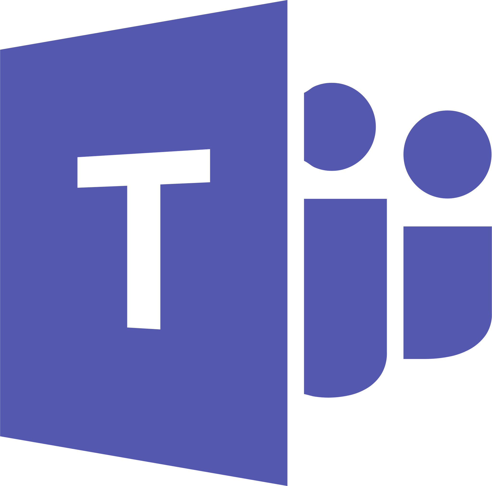

# Hello there, I'm Thomas

#### Connect With Me
[][LinkedIn]&nbsp;&nbsp;&nbsp;&nbsp;

#### Check Out My Playlist!
<a href="https://open.spotify.com/playlist/1rc4BEo9sw0wfW57AnoY9l?si=acfbde41fa174468">
   
</a>

<br>

[](https://open.spotify.com/user/qqcq2h6pr1xe9p1s792354sk4?si=325faf9422d44a18&nd=1)

#### Languages

<div float="left">
    &nbsp;&nbsp;&nbsp;&nbsp;
    &nbsp;&nbsp;&nbsp;&nbsp;
    &nbsp;&nbsp;&nbsp;&nbsp;
    &nbsp;&nbsp;&nbsp;&nbsp;
    &nbsp;&nbsp;&nbsp;&nbsp;
    &nbsp;&nbsp;&nbsp;&nbsp;
    &nbsp;&nbsp;&nbsp;&nbsp;
    &nbsp;&nbsp;&nbsp;&nbsp;
    &nbsp;&nbsp;&nbsp;&nbsp;
    &nbsp;&nbsp;&nbsp;&nbsp;
</div>

#### Tools

<div float="left">
    &nbsp;&nbsp;&nbsp;&nbsp;
    &nbsp;&nbsp;&nbsp;&nbsp;
    &nbsp;&nbsp;&nbsp;&nbsp;
    &nbsp;&nbsp;&nbsp;&nbsp;
    &nbsp;&nbsp;&nbsp;&nbsp;
</div>

<!-- To be Included, Need Better Images, and Update.

    

    &nbsp;&nbsp;&nbsp;&nbsp;

    

    
-->

---

### *I love to learn and I'm a problem solver at heart*

---

#### General Information About Me

- Computer Science 💻 Major at Wayne State College
- Love listening to music 🎧
- Enjoy watching the NFL 🏈 and NBA 🏀
  - Specifically the Packers and Warriors
- Have a deep interest in warplanes and flight sims ✈
- Always open to trying something new and getting out of my comfort zone

---

#### Major Goals

- [ ] Lead the ACM Software Team to Complete Projects
   - Worked on Pen-testing with Kali Linux VMs on HackTheBox and OverTheWire
- [ ] Create a Simple Mod for a Game
- [ ] Develop a Simple 3D Game with Unreal/Unity
- [ ] Create a Portfolio Website
   - Working on it! [Todo Manager]
- [X] Obtain an Internship for the Summer of 2022
   - Interned at Cruise & Associates as an Accounting Intern
- [X] Obtain an Internship for the Spring of 2023
   - Intern at Daycos as a Software Engineer
- [ ] Obtain an Internship for the Summer of 2023

---

#### Minor Goals

- [ ] Create 5 Python/Bash Automation Projects
   - [Python Downloads Cleanup]
   - [Hack The Box OpenVPN Bash Startup]
- [ ] Complete the Harvard CS-50P Course
   - [CS-50P Problem Sets]
- [ ] Participate in Coding Competitions
   - Google's Hash Code Competition - ACM team at WSC
- [ ] Get Exposure to ML & AI
- [ ] Get Exposure to Working with Embedded Systems

---

#### WakaTime Stats

<!--START_SECTION:waka-->


**🐱 My GitHub Data** 

> 🏆 105 Contributions in the Year 2023
 > 
> 📦 582.7 kB Used in GitHub's Storage 
 > 
> 🚫 Not Opted to Hire
 > 
> 📜 6 Public Repositories 
 > 
> 🔑 3 Private Repositories  
 > 
**I'm a Night 🦉** 

```text
🌞 Morning    124 commits    ██████░░░░░░░░░░░░░░░░░░░   24.55% 
🌆 Daytime    75 commits     ███░░░░░░░░░░░░░░░░░░░░░░   14.85% 
🌃 Evening    125 commits    ██████░░░░░░░░░░░░░░░░░░░   24.75% 
🌙 Night      181 commits    █████████░░░░░░░░░░░░░░░░   35.84%

```
📅 **I'm Most Productive on Thursday** 

```text
Monday       67 commits     ███░░░░░░░░░░░░░░░░░░░░░░   13.27% 
Tuesday      73 commits     ███░░░░░░░░░░░░░░░░░░░░░░   14.46% 
Wednesday    79 commits     ████░░░░░░░░░░░░░░░░░░░░░   15.64% 
Thursday     104 commits    █████░░░░░░░░░░░░░░░░░░░░   20.59% 
Friday       71 commits     ███░░░░░░░░░░░░░░░░░░░░░░   14.06% 
Saturday     27 commits     █░░░░░░░░░░░░░░░░░░░░░░░░   5.35% 
Sunday       84 commits     ████░░░░░░░░░░░░░░░░░░░░░   16.63%

```


📊 **This Week I Spent My Time On** 

```text
⌚︎ Time Zone: America/Chicago

💬 Programming Languages: 
JavaScript               22 hrs 14 mins      ███████████████░░░░░░░░░░   60.42% 
CSS                      6 hrs 4 mins        ████░░░░░░░░░░░░░░░░░░░░░   16.5% 
HTML                     5 hrs 5 mins        ███░░░░░░░░░░░░░░░░░░░░░░   13.84% 
C++                      1 hr 8 mins         ░░░░░░░░░░░░░░░░░░░░░░░░░   3.11% 
Python                   54 mins             ░░░░░░░░░░░░░░░░░░░░░░░░░   2.49%

🔥 Editors: 
VS Code                  35 hrs 32 mins      ████████████████████████░   96.56% 
PyCharm                  1 hr 15 mins        ░░░░░░░░░░░░░░░░░░░░░░░░░   3.44%

🐱‍💻 Projects: 
Nottommy11.github.io     21 hrs 51 mins      ██████████████░░░░░░░░░░░   59.4% 
Undergrad_Projects       8 hrs 48 mins       ██████░░░░░░░░░░░░░░░░░░░   23.94% 
erickmarxsen.github.io   2 hrs 45 mins       ██░░░░░░░░░░░░░░░░░░░░░░░   7.51% 
Class Work               2 hrs 2 mins        █░░░░░░░░░░░░░░░░░░░░░░░░   5.56% 
Morse Encoder            24 mins             ░░░░░░░░░░░░░░░░░░░░░░░░░   1.1%

💻 Operating System: 
Windows                  36 hrs 48 mins      █████████████████████████   100.0%

```

**I Mostly Code in JavaScript** 

```text
JavaScript               4 repos             ████████░░░░░░░░░░░░░░░░░   33.33% 
Python                   3 repos             ██████░░░░░░░░░░░░░░░░░░░   25.0% 
HTML                     2 repos             ████░░░░░░░░░░░░░░░░░░░░░   16.67% 
PHP                      1 repo              ██░░░░░░░░░░░░░░░░░░░░░░░   8.33% 
C#                       1 repo              ██░░░░░░░░░░░░░░░░░░░░░░░   8.33%

```


**Timeline**

 


 Last Updated on 01/02/2023 18:42:09 UTC
<!--END_SECTION:waka-->

*I don't think that chart is working properly*

---

<div float="left">
    
    
</div>

---


---

#### Breakdown of Experience

| Language/Tool | Source(s) of Experience | Level of Comfort (1-10) |
| :-----------: | :---------------------: | :--------------------: |
|  | [CPP Undergrad Projects] | 6 |
|  | Tutorials, W3 Schools, [C Undergrad Projects] | 4 |
|  | Unity Tutorials & ACM Club | 3 |
|  | [Java Undergrad Projects] | 6 |
|  | [Python Undergrad Projects] | 6 |
|  | [Markdown Undergrad Projects] & my Page | 6 |
|  | [HTML5 Undergrad Projects] | 5 |
|  | [CSS3 Undergrad Projects] | 2 |
|  | [Sass Undergrad Projects] | 2 |
|  | Intro to Database at WSC | 4 |
|  | Editor of Choice | 7 |
|  | Used at WSC and for Personal Projects | 6 |
|  | Communication Channel for ACM & CEO | 8 |
|  | Communication Channel for ACM & UPE | 7 |
|  | Operating System of Choice | 8 |

<!-- 
    SVG website that I got a lot of images from: https://worldvectorlogo.com/
    Or you could just use mine
    Tutorial I started with for Markdown: https://github.com/codeSTACKr/codeSTACKr/blob/master/README.md
    How to add recently played from Spotify: https://youtu.be/ZTYPybjYqpo
-->

<!-- General Links -->
[LinkedIn]: https://www.linkedin.com/in/thomas-marxsen

<!-- Major Goals Links -->
[Todo Manager]: https://nottommy11.github.io/index.html

<!-- Python/Bash Automation Links -->
[Python Downloads Cleanup]: https://github.com/Nottommy11/Undergrad_Projects/blob/main/Python/Downloads%20File%20Type%20Manager/downloads_cleanup.py
[Hack The Box OpenVPN Bash Startup]: https://github.com/Nottommy11/Undergrad_Projects/blob/main/Bash/HackTheBoxOpenVPN.sh

<!-- Other Goals Links -->
[CS-50P Problem Sets]: https://github.com/Nottommy11/Undergrad_Projects/tree/main/Python/CS-50P

<!-- Experience Table Links -->
[CPP Undergrad Projects]: https://github.com/Nottommy11/Undergrad_Projects/tree/main/CPP
[C Undergrad Projects]: https://github.com/Nottommy11/Undergrad_Projects/tree/main/C
[Java Undergrad Projects]: https://github.com/Nottommy11/Undergrad_Projects/tree/main/Java
[Python Undergrad Projects]: https://github.com/Nottommy11/Undergrad_Projects/tree/main/Python
[Markdown Undergrad Projects]: https://github.com/Nottommy11/Undergrad_Projects/tree/main/Markdown
[HTML5 Undergrad Projects]: https://github.com/Nottommy11/Undergrad_Projects/tree/main/Web%20Development
[CSS3 Undergrad Projects]: https://github.com/Nottommy11/Undergrad_Projects/tree/main/Web%20Development
[Sass Undergrad Projects]: https://github.com/Nottommy11/Undergrad_Projects/tree/main/Web%20Development
